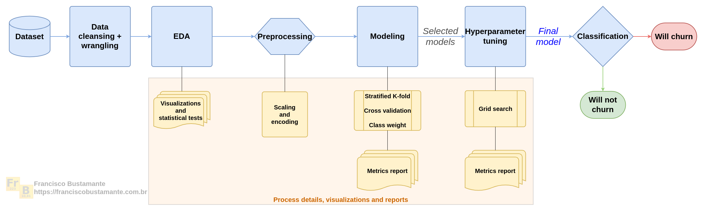
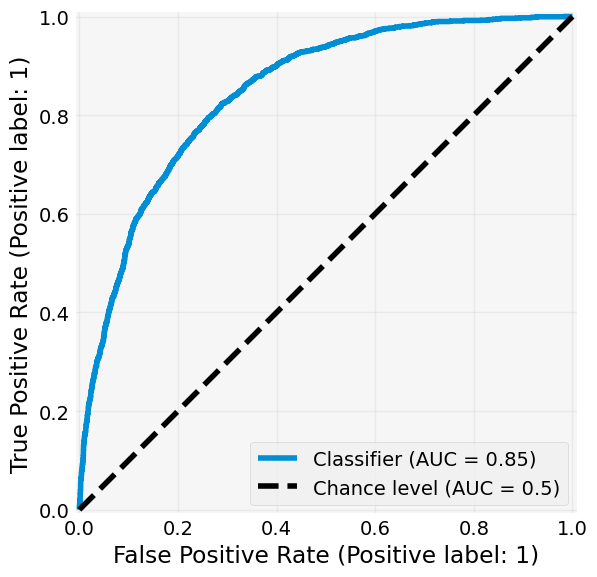
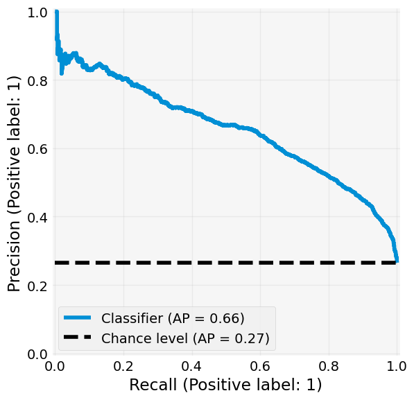

[](https://www.linkedin.com/in/flsbustamante/)
[](https://pyscaffold.org/)
[](https://www.python.org/)

# Churn prediction project

> Predicting customer churn with machine learning

This project aims to predict customer churn using machine learning.

The project demonstrates a complete pipeline — from preprocessing, through stratified
cross-validation and model training with class weight adjustments, to model evaluation
using metrics such as average precision (AUPRC), recall, and AUROC.

In addition to implementing various machine learning algorithms, the project emphasizes
model interpretability, providing actionable insights for real-world decision making.

This work serves as a practical example of how advanced data science techniques can be
applied to improve churn prediction systems in the business world.

I wrote an article about this project on my portfolio webpage. You can check it out
[here](https://franciscobustamante.com.br/portfolio/2022-06-project_churn_prediction/).

## Main results

The study was divided into five main parts, each one with its own notebook in the
[`notebooks`](notebooks/) folder:

1. **Data cleansing and feature engineering**: The dataset was cleaned and transformed
   to improve the performance of the machine learning models.
   [Notebook 1](notebooks/01-flsb-data_cleansing.ipynb).
2. **Exploratory data analysis**: The dataset was analyzed to understand the distribution
   of the features and the target variable.
   [Notebook 2](notebooks/02-flsb-eda.ipynb).
3. **Model training and evaluation**: Several machine learning models were trained and
   evaluated using cross-validation.
   [Notebook 3](notebooks/03-flsb-classification_models.ipynb).

The project's pipeline can be summarized as follows:



The final model, a Logistic Regression with elastic net regularization, class weight
adjustment, and preprocessing, has the following metrics:

|AUROC|AUPRC|
|-------------------------------------|-------------------------------------|
|  |  |

| Metric             | Score    | Std Dev  |
|--------------------|----------|----------|
| Accuracy           | 0.752234 | 0.007329 |
| Balanced Accuracy  | 0.766082 | 0.009746 |
| F1                 | 0.630180 | 0.011178 |
| Precision          | 0.521791 | 0.009259 |
| Recall             | 0.795597 | 0.018686 |
| ROC AUC            | 0.846659 | 0.012375 |
| Average Precision  | 0.658425 | 0.020138 |
| F1 Weighted        | 0.764995 | 0.006898 |


## Installation

In order to set up the necessary environment:

1. review and uncomment what you need in `environment.yml` and create an environment `churn` with the help of [conda]:
   ```
   conda env create -f environment.yml
   ```
2. activate the new environment with:
   ```
   conda activate churn
   ```
3. install the package in editable mode with:
   ```
   pip install -e .
   ```
   This will install the package in editable mode, so you can modify the source code and
   directly import the package in Python.

> **_NOTE:_**  The conda environment will have churn installed in editable mode.
> Some changes, e.g. in `setup.cfg`, might require you to run `pip install -e .` again.


Optional and needed only once after `git clone`:

4. install several [pre-commit] git hooks with:
   ```bash
   pre-commit install
   # You might also want to run `pre-commit autoupdate`
   ```
   and checkout the configuration under `.pre-commit-config.yaml`.
   The `-n, --no-verify` flag of `git commit` can be used to deactivate pre-commit hooks temporarily.

5. install [nbstripout] git hooks to remove the output cells of committed notebooks with:
   ```bash
   nbstripout --install --attributes notebooks/.gitattributes
   ```
   This is useful to avoid large diffs due to plots in your notebooks.
   A simple `nbstripout --uninstall` will revert these changes.


Then take a look into the `src` and `notebooks` folders.

### MLFlow setup

The notebooks have all the consolidated results of the models, with the numerical results
and visualizations. If you want even more detailed results, you can use MLFlow to track
the experiments. To set up MLFlow, you need to:

1. Open the `.env` file present in the `src/churn` folder.
2. Set the `MLFLOW_ON` variable to True.
3. Run the code of the classification notebook.
4. A folder called `mlruns` will be created in the `notebooks` folder.
5. To see the results, you need to run the following command in the terminal:
   ```bash
   mlflow ui
   ```

## Dependency Management & Reproducibility

1. Always keep your abstract (unpinned) dependencies updated in `environment.yml` and eventually
   in `setup.cfg` if you want to ship and install your package via `pip` later on.
2. Create concrete dependencies as `environment.lock.yml` for the exact reproduction of your
   environment with:
   ```bash
   conda env export -n churn -f environment.lock.yml
   ```
   For multi-OS development, consider using `--no-builds` during the export.
3. Update your current environment with respect to a new `environment.lock.yml` using:
   ```bash
   conda env update -f environment.lock.yml --prune
   ```
## Project Organization

```
├── AUTHORS.md              <- List of developers and maintainers.
├── CHANGELOG.md            <- Changelog to keep track of new features and fixes.
├── CONTRIBUTING.md         <- Guidelines for contributing to this project.
├── LICENSE.txt             <- License as chosen on the command-line.
├── README.md               <- The top-level README for developers.
├── data
│   ├── external            <- Data from third party sources.
│   ├── interim             <- Intermediate data that has been transformed.
│   ├── processed           <- The final, canonical data sets for modeling.
│   └── raw                 <- The original, immutable data dump.
├── docs                    <- Directory for Sphinx documentation in rst or md.
├── environment.yml         <- The conda environment file for reproducibility.
├── models                  <- Trained and serialized models, model predictions,
│                              or model summaries.
├── notebooks               <- Jupyter notebooks. Naming convention is a number (for
│                              ordering), the creator's initials and a description,
│                              e.g. `1.0-fw-initial-data-exploration`.
├── pyproject.toml          <- Build configuration. Don't change! Use `pip install -e .`
│                              to install for development or to build `tox -e build`.
├── references              <- Data dictionaries, manuals, and all other materials.
├── reports                 <- Generated analysis as HTML, PDF, LaTeX, etc.
│   └── figures             <- Generated plots and figures for reports.
├── setup.cfg               <- Declarative configuration of your project.
├── setup.py                <- [DEPRECATED] Use `python setup.py develop` to install for
│                              development or `python setup.py bdist_wheel` to build.
├── src
│   └── churn               <- Actual Python package where the main functionality goes.
├── tests                   <- Unit tests which can be run with `pytest`.
├── .coveragerc             <- Configuration for coverage reports of unit tests.
├── .isort.cfg              <- Configuration for git hook that sorts imports.
└── .pre-commit-config.yaml <- Configuration of pre-commit git hooks.
```

## Citing

If you use this project in a scientific publication or in classes, please consider
citing as

F. L. S. Bustamante, Churn prediction, 2022 - Available at:
https://github.com/chicolucio/churn-prediction

## My Links

- [LinkedIn](https://www.linkedin.com/in/flsbustamante/)
- [Portfolio](https://franciscobustamante.com.br/portfolio)
- [Curriculum Vitae](https://franciscobustamante.com.br/about/)


<!-- pyscaffold-notes -->

## Note

This project has been set up using [PyScaffold] 4.6 and the [dsproject extension] 0.7.2.

[conda]: https://docs.conda.io/
[pre-commit]: https://pre-commit.com/
[Jupyter]: https://jupyter.org/
[nbstripout]: https://github.com/kynan/nbstripout
[Google style]: http://google.github.io/styleguide/pyguide.html#38-comments-and-docstrings
[PyScaffold]: https://pyscaffold.org/
[dsproject extension]: https://github.com/pyscaffold/pyscaffoldext-dsproject
